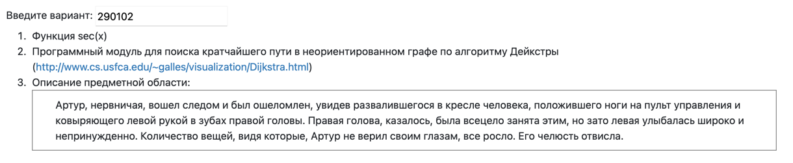

# Лабораторная работа 1

---

### Вариант `290102`

> Махмудова Мария Александровна \
> P3324 \
> 290102

---

### Задание

<table>
  <tr>
     
  </tr>
</table>

1. Для указанной функции провести модульное тестирование **разложения функции в степенной ряд**. Выбрать достаточное тестовое покрытие.
    - Функция `sec(x)`;
2. Провести модульное тестирование указанного алгоритма. Для этого выбрать характерные точки внутри алгоритма, и для предложенных самостоятельно наборов исходных данных записать последовательность попадания в характерные точки. Сравнить последовательность попадания с эталонной.
    - Программный модуль для поиска кратчайшего пути в неориентированном графе по алгоритму Дейкстры (http://www.cs.usfca.edu/~galles/visualization/Dijkstra.html);
3. Сформировать доменную модель для заданного текста. Разработать тестовое покрытие для данной доменной модели:

> Артур, нервничая, вошел следом и был ошеломлен, увидев развалившегося в кресле человека, положившего ноги на пульт управления и ковыряющего левой рукой в зубах правой головы. Правая голова, казалось, была всецело занята этим, но зато левая улыбалась широко и непринужденно. Количество вещей, видя которые, Артур не верил своим глазам, все росло. Его челюсть отвисла.

### Вопросы к защите лабораторной работы:

1. Понятие тестирования ПО. Основные определения.
2. Цели тестирования. Классификация тестов.
3. Модульное тестирование. Понятие модуля.
4. V-образная модель. Статическое и динамическое тестирование.
5. Валидация и верификация. Тестирование методом "чёрного" и "белого" ящика.
6. Тестовый случай, тестовый сценарий и тестовое покрытие.
7. Анализ эквивалентности.
8. Таблицы решений и таблицы переходов.
9. Регрессионное тестирование.
10. Библиотека `JUnit`. Особенности API. Класс `junit.framework.Assert`.
11. Отличия `JUnit 3` от `JUnit 4`.

---